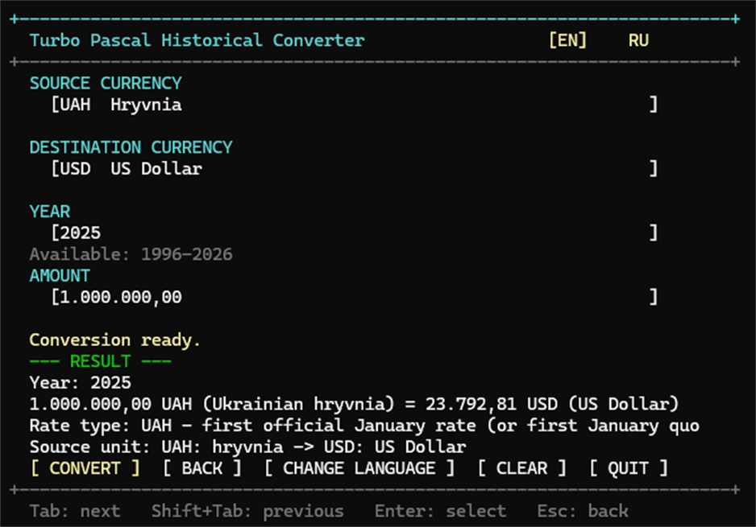
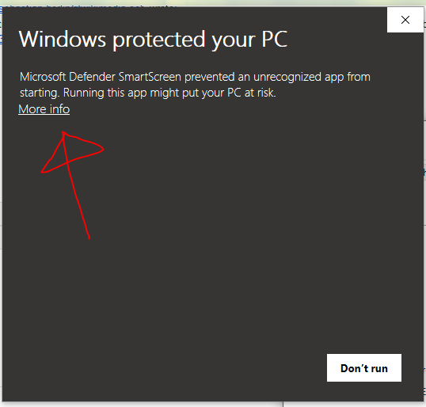

# Turbo Pascal Historical Currency Converter

A small retro-programming experiment: a historical currency converter written
entirely in Pascal. It uses Free Pascal Compiler in Turbo Pascal compatibility
mode (`{$mode TP}`) and runs as a native 64-bit Windows console application.
DOSBox, Lazarus, Delphi, and a separate runtime are not required.

> **THIS IS NOT A LIVE EXCHANGE-RATE SERVICE.** Rates are compiled into the
> program and never update automatically.



*Example of the application interface after a historical conversion.*

## Download

Download [TurboPascalCurrencyConverter.exe from the latest GitHub
Release](https://github.com/Cresscendoll/turbo-pascal-converter/releases/latest).
Run the file directly on Windows 10 or Windows 11 x64; there is no installer
and the application does not need an Internet connection.

## Windows SmartScreen notice

Windows 10 or Windows 11 **may** show a red SmartScreen / Microsoft Defender
warning such as **“Windows protected your PC”** (or the localized equivalent)
when you launch the downloaded EXE. Not every user will see this warning.

This can happen because the EXE is an independent unsigned build: it does not
have a commercial code-signing certificate, and it is a new or low-reputation
executable from Microsoft's perspective. This warning by itself does **not**
mean that Windows detected malware.



*Example of the kind of SmartScreen warning Windows may display for an
unsigned executable. [Illustrative screenshot source: Wikimedia
Commons](https://commons.wikimedia.org/wiki/File:Windows-protected-your-pc-more-info.png);
the image is stored locally in this repository.*

If you are unsure about the prebuilt binary, you can verify the project
independently. The complete Pascal source code is public in this repository,
the GitHub Release is built from the tagged public source revision, GitHub
provides source-code archives for the release, and the SHA-256 checksum of the
official EXE is published in the release notes. You can also build the
application yourself with Free Pascal instead of running the provided binary.

Do not disable SmartScreen or Windows Defender globally. Review the release
page, source, checksum, and your own security policy before deciding whether
to run any downloaded executable.

## What it does

- Converts between 32 currencies, including UAH, RUB, and BYN.
- Uses the first valid official observation in January for a selected year.
  If 1 January has no quote because of a holiday or source calendar, the first
  available January quote is used. It does not calculate an annual average or a
  year-to-date average.
- Covers the 1992–2026 range where the underlying institutional data is
  available. Currency histories are intentionally not padded with invented
  values.
- Keeps historical units visible around redenominations and predecessor
  currencies, including Ukrainian coupon-karbovanets before the hryvnia.
- Provides English and Russian labels, keyboard controls, and native Windows
  console mouse input in a deliberately simple retro TUI.

The TUI is designed for a console viewport of at least **72 × 24** characters.
On a smaller window it shows a localized resize message while keeping the
keyboard path available. If native mouse input is unavailable, the same
controls remain usable from the keyboard.

## Historical data

The development snapshot is labeled **2026-09-05**. The embedded database
contains **1,070** start-of-year records. The label is the development cutoff;
the selected 2026 value is still the first January observation, not a
September YTD value.

Every stored value means currency units per 1 USD. Conversion uses the common
USD pivot:

```text
amount / source_units_per_usd * destination_units_per_usd
```

The available years depend on the selected pair. For example, UAH starts in
1996 in this January-rate dataset, EUR starts in 1999, and RUB starts in
1993. See [SOURCES.md](SOURCES.md) for the rate convention, coverage table,
source links, and historical denomination notes.

## Offline by design

The finished application contains no HTTP or HTTPS requests, sockets, API
calls, downloads, telemetry, or external rate files. All rates are hard-coded
in Pascal source. Internet access was used only during development to obtain
the documented data; the executable has no runtime network path.

## Build from source

Install Free Pascal Compiler. The published build was compiled with **FPC
3.2.2** for the native Win64 target. From the repository directory, a
compatible compiler on `PATH` can build and run the program with:

```text
fpc -B -O2 -vw -Fu. -FEbuild -FUbuild -obuild\currency_converter.exe currency_converter.pas
build\currency_converter.exe
```

The exact compiler command used for the validated Windows build was:

```text
C:\FPC\3.2.2\bin\i386-win32\ppcrossx64.exe -B -O2 -vw -Fu. -FE..\build-x64 -FU..\build-x64 -o..\build-x64\currency_converter.exe currency_converter.pas
```

The output directory is outside the source tree in that command, so compiler
artifacts do not become repository files.

## Project structure

- `currency_converter.pas` — main application and conversion flow.
- `historical_rates.pas` — static historical rate records compiled into the
  executable.
- `localization.pas` — English and Russian text resources.
- `tui.pas` — native Windows console, keyboard, and mouse adapter.
- `SOURCES.md` — data sources, methodology, coverage, and denomination notes.
- `README.md` — project documentation.
- `LICENSE` — MIT license.
- `.gitignore` and `.gitattributes` — repository housekeeping.

There are no runtime data downloads, external assets, or non-Pascal program
sources in the repository.

## Data sources

The static records were assembled during development from reputable
institutional sources: Federal Reserve H.10 daily exchange-rate series,
National Bank of Ukraine open data, Bank of Russia official dynamics, and the
National Bank of the Republic of Belarus API. Fixed AED and SAR parities are
documented from the relevant central banks. The complete source list and
selection method are in [SOURCES.md](SOURCES.md).

## License

Released under the [MIT License](LICENSE).
